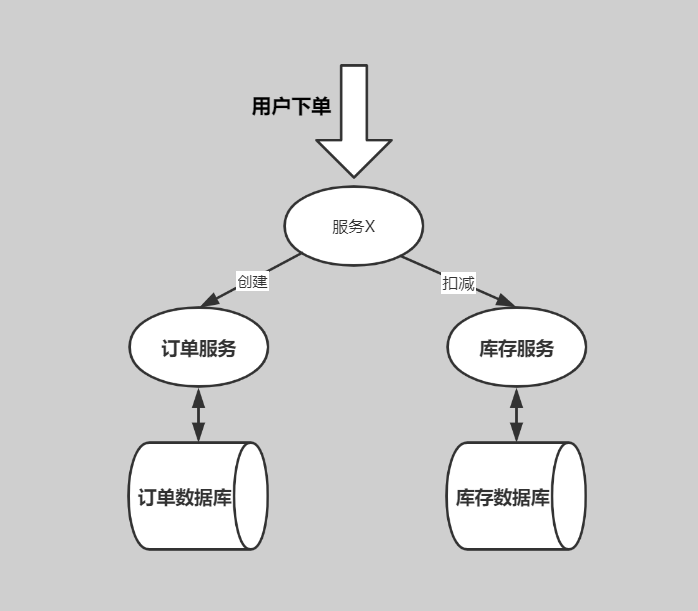

# 分布式事务

**作为单个逻辑工作单元执行的一系列操作，要么全部执行，要么全部不执行。** 

- 2pc（两段式提交）
- 3pc（三段式提交）
- TCC（Try、Confirm、Cancel）
- 半消息/最终一致性（RocketMQ）

## 2PC

说到 2PC 就不得不聊数据库分布式事务中的 XA Transactions。

在 XA 协议中分为两阶段：

1. 事务管理器要求每个涉及到事务的数据库预提交(precommit)此操作，并反映是否可以提交。
1. 事务协调器要求每个数据库提交数据，或者回滚数据。

优点：

尽量保证了数据的强一致，实现成本较低，在各大主流数据库都有自己实现，对于 MySQL 是从 5.5 开始支持。
缺点：

单点问题：事务管理器在整个流程中扮演的角色很关键，如果其宕机，比如在***阶段已经完成，在第二阶段正准备提交的时候事务管理器宕机，资源管理器就会一直阻塞，导致数据库无法使用。
同步阻塞：在准备就绪之后，资源管理器中的资源一直处于阻塞，直到提交完成，释放资源。
数据不一致：两阶段提交协议虽然为分布式数据强一致性所设计，但仍然存在数据不一致性的可能。
比如在第二阶段中，假设协调者发出了事务 Commit 的通知，但是因为网络问题该通知仅被一部分参与者所收到并执行了 Commit 操作，其余的参与者则因为没有收到通知一直处于阻塞状态，这时候就产生了数据的不一致性。

总的来说，XA 协议比较简单，成本较低，但是其单点问题，以及不能支持高并发(由于同步阻塞)依然是其***的弱点。

https://www.jianshu.com/p/dd6a340e50b2

## 什么是分布式事务

在分布式系统中一次操作由多个系统协同完成，这种一次事务操作涉及多个系统通过网络协同完成的过程称为分布式事务。这里强调的是多个系统通过网络协同完成一个事务的过程，并不强调多个系统访问了不同的数据库，即使多个系统访问的是同一个数据库也是分布式事务，如下图：

上图所示，典型的场景就是微服务架构，微服务之间通过远程调用完成事务操作。比如 ：订单微服务和库存微服务，下单的同时订单微服务请求库存微服务减库存。简言之 ：跨JVM进程产生分布式事务。

上图所示为跨数据库实例产生分布式事务。

当单体系统需要访问多个数据库（实例）时就会产生分布式事务。比如：订单信息和库存信息分别在两个MySQL实例存储，用户下单需要分别去创建订单和扣减库存，由于数据分布在不同的数据实例，需要通过不同的数据库链接去操作数据，此时产生分布式事务。简言之 ：跨数据库实例产生分布式事务。

上图所示为多服务访问同一个数据库实例。

订单微服务和库存微服务即使访问同一个数据库也会产生分布式事务，原因就是跨JVM进程，两个微服务持有了不同的数据库链接进行数据库操作，此时产生分布式事务。