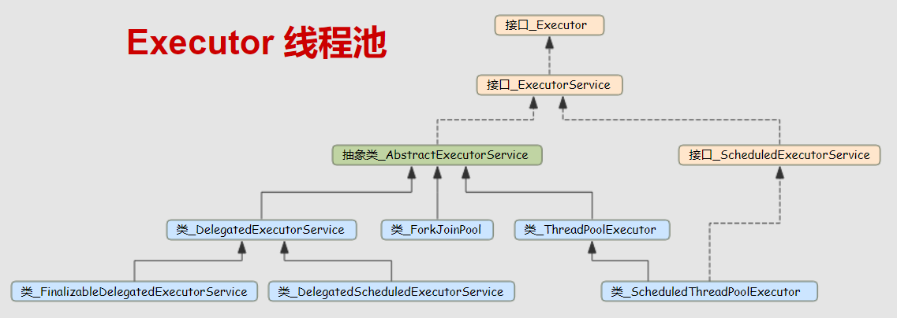
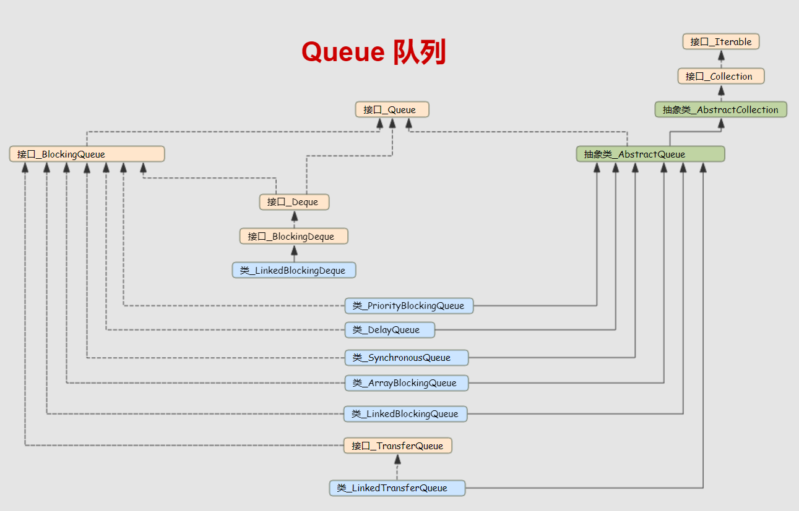

# 线程池

<!-- TOC -->

- [线程池](#线程池)
    - [线程池工厂类有多少种](#线程池工厂类有多少种)
    - [ThreadPoolExecutor](#threadpoolexecutor)
    - [重要参数](#重要参数)
    - [RejectedExecutionHandler](#rejectedexecutionhandler)
    - [队列](#队列)

<!-- /TOC -->

## 线程池工厂类有多少种

　　java1.8 的官方文档提供了三种线程池工厂类，每种线程池工厂类型对应不同线程管理方式（策略）。

　　newCachedThreadPool（自动废弃回收）:

　　当有可用的空闲线程，优先使用空闲线程，当没有可用的空闲线程的时候就创建新的线程。空闲线程超过60s没有被使用，将会关闭并从线程缓冲区中删除。这种设计的好处就是当并发高峰期过了之后，大量的空闲线程就会被回收，节省系统资源。

　　newFixedhreadPool（固定线程池大小）:

　　首先创建一个固定线程大小的线程池，将所有的线程激活，创建一个无界任务队列存放所有的任务，当线程池中有可用的空闲线程，队列的任务就会被消费，当线程池中没有空闲线程，任务队列中的任务就等待，直到有线程被空出。当某个线程应为运行期间被异常关闭，其他的线程将会接替其运行后来的任务。这种线程池的好处就是不会再高峰的时候一直创建新的线程。线程空闲的时候也不会被销毁。除非程序员手动明确的调用关闭线程池的方法。　　　　　　　　　　　　　　　　　

　　newSingleThreadExecutor（单工作线程）: 任何时候都只有一个线程被激活处理无界任务队列，当运行中的线程因为异常而关闭的时候，新的线程将被创建，这样的线程池将保证所有的任务顺序执行。

## ThreadPoolExecutor 

- corePoolSzie:这个参数是线程池的核心参数，表示当前线程数小于corePoolSize的时候，线程池每接收一个新的任务将创建一个新的线程，即使有空闲的线程也不会复用。　
- maximumPoolSize：最大线程池大小，顾名思义，线程池能创建的线程的最大数目
- keepAliveTime:非核心线程能存活的最大时间。当线程数超过corePoolSize的时候，当有空闲的线程时间超过keepAliveTime将会被回收。
- unit:时间的单位
- workQueue:线程池将要消费的任务，这个任务的类型必须是线程，要继承Runnable 的接口，就这是为什么要叫线程池，对于阻塞队列，一般会有ArrayBlockingQueue,LinkedBlockQueue,synchronousQueue 三种。
- RejectedExecutionHandler :默认的拒绝策略，当线程池关闭的时候，新的任务将被拒绝，并且展现不同的处理策略

> 注意：excutor.shutDown(); 方法是将线程池关闭，已经在线程池中的任务将会继续执行，没有被接受的任务将不会在处理。
当线程池的队列用的 `ArrayBlockingQueue` 的时候，若线程池中的所有线程都被用完，并且还有任务进入队里将会抛出RejectedExecutionException

## 重要参数

corePoolSize 和 maximumPoolSize 

默认情况下线程中的线程初始时为 0， 当有新的任务到来时才会创建新线程，当线程数目到达 corePoolSize 的数量时，新的任务会被缓存到 workQueue 队列中。如果不断有新的任务到来，队列也满了的话，线程池会再新建线程直到总的线程数目达到 maximumPoolSize。如果还有新的任务到来，则要根据 handler 对新的任务进行相应拒绝处理。

## RejectedExecutionHandler 

当队列和线程池都满了，说明线程池处于饱和状态，那么必须采取一种策略处理提交的新任务。有下面四种JDK提供的策略：

- AbortPolicy，表示无法处理新任务时抛出异常, 默认策略
- CallerRunsPolicy：用调用者所在线程来运行任务。
- DiscardOldestPolicy： 该策略将丢弃最老的一个请求，也就是即将被执行的任务，并尝试再次提交当前任务。
- DiscardPolicy：不处理，丢弃掉 
除了这些JDK提供的策略外，还可以自己实现 RejectedExecutionHandler 接口定义策略。

## 队列

